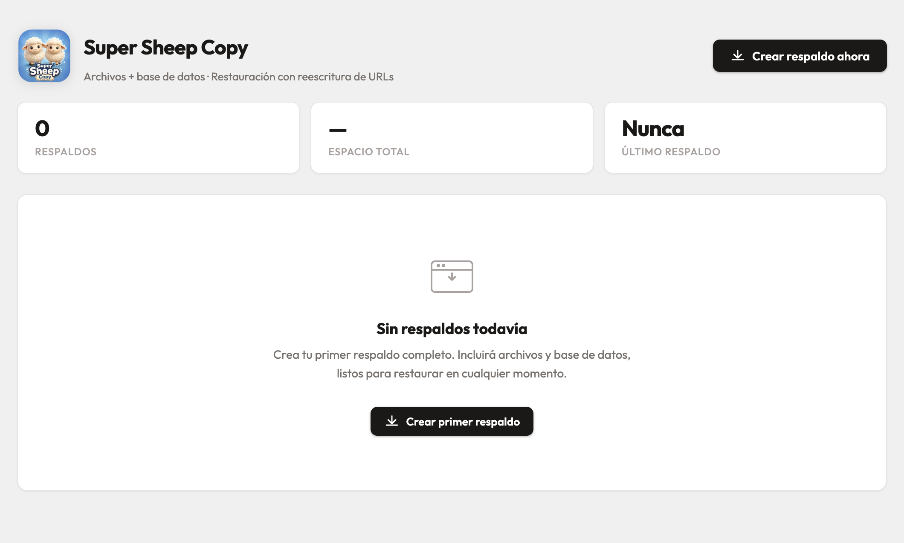

<p align="center">
  
</p>

# Super Sheep Copy

**Full-site backup plugin for WordPress.** Creates complete ZIP archives of your site (files + database), lets you download or delete them, and restores them with safe URL rewriting for domain migrations.



---

## Features

### Backups

- **Full-site ZIP** — packages all of `wp-content/`, root config files (`.htaccess`, `wp-config.php`, `robots.txt`, etc.), and optionally the WordPress core directories (`wp-admin/` and `wp-includes/`).
- **Database dump** — exports all tables matching the configured prefix. Falls back to a pure-PHP streamed dump when `mysqldump` is unavailable.
- **manifest.json** — every ZIP includes a manifest with site URL, PHP/WP versions, table prefix, charset, file count, DB size, and a SHA-256 checksum of the archive.
- **Checksum file** — a companion `.sha256` file is created next to each ZIP for integrity verification.
- **Pre-restore snapshot** — before overwriting anything during a restore, the plugin automatically creates a safety backup of the current site state.
- **Smart naming** — backup filenames include a timestamp and a random 8-character hex token to prevent enumeration (`backup-20260422-143055-a3f9b2c1.zip`).

### Backup list

- Shows filename, date, size, type badge (Manual / Automatic / Scheduled), and short checksum.
- **Download** — served through an authenticated admin endpoint (`readfile()`). No direct file URL is exposed.
- **Restore** — one-click restore from any listed backup.
- **Delete** — with confirmation; supports bulk deletion.
- **View manifest** — inline modal showing the full `manifest.json` content.

### Restoration

- Validates the ZIP (magic bytes + `manifest.json` check + optional checksum comparison) before doing anything.
- Extracts files to a temporary directory first, then moves them atomically.
- Imports the SQL dump statement-by-statement, handling multi-line statements and DELIMITER changes.
- Automatically rewrites the old `siteurl`/`home` and all serialized option values if you are restoring to a different domain or path (**serialize-safe URL rewriting** — updates `s:N:"..."` lengths correctly so WordPress-serialized data is never broken).
- Flushes rewrite rules and object cache after import.
- Force-logs out all active sessions after a restore (security measure when importing a foreign database).

### Upload methods

Backup ZIPs can reach the server in two ways:

| Method             | How                                                                                                             |
| ------------------ | --------------------------------------------------------------------------------------------------------------- |
| Browser upload     | Use the **Restaurar** page form — max size is the lesser of the plugin setting and the PHP server limit.        |
| FTP / file manager | Upload the ZIP directly to `wp-content/uploads/fsb-backups/` — it will appear in the backup list automatically. |

### Settings

- **Include WordPress core** — toggle whether `wp-admin/` and `wp-includes/` are packaged in the backup (on by default; useful for bare-metal restores).
- **Exclude large logs** — skip `.log` and `.tmp` files to reduce archive size.
- **Max upload size** — configurable MB limit for browser uploads. The UI shows the actual PHP server limit (`upload_max_filesize` / `post_max_size`) and the resulting effective limit (whichever is lower). Saving a value that exceeds the server limit triggers an admin warning.

### Audit log

- Every backup and restore operation is recorded in the `{prefix}fsb_audit_log` table.
- Log entries are grouped by operation (job ID), showing overall status, duration, file name, user, error/warning counts, and a full expandable entry table.
- Actions include: expand all, collapse all, clear log.

---

## Requirements

| Requirement   | Minimum                          |
| ------------- | -------------------------------- |
| WordPress     | 6.0                              |
| PHP           | 7.4 (8.1+ recommended)           |
| PHP extension | `ZipArchive`                     |
| Server        | Apache, LiteSpeed, Nginx, or IIS |

---

## Installation

1. Upload the `full-site-backup/` folder to `wp-content/plugins/`.
2. Activate the plugin from **Plugins → Installed Plugins**.
3. On activation the plugin automatically:
   - Creates `wp-content/uploads/fsb-backups/` with `.htaccess`, `web.config`, and `index.php` protection files.
   - Creates the `{prefix}fsb_audit_log` database table.
   - Adds the `manage_fsb_backups` capability to the Administrator role.

---

## Usage

### Creating a backup

1. Go to **Respaldos** in the WordPress admin sidebar.
2. Click **Crear respaldo ahora**.
3. A progress bar tracks the operation (DB dump → file packaging → manifest → checksum).
4. The new backup appears in the list when complete.

### Restoring a backup

**Option A — from the backup list:**

1. Go to **Respaldos**, find the backup you want, and click **Restaurar**.
2. Confirm the dialog. A pre-restore safety backup is created automatically.
3. Wait for the progress bar to complete.
4. You will be logged out and redirected to the login screen (security measure).

**Option B — upload a ZIP:**

1. Go to **Restaurar** in the sidebar.
2. Select your `.zip` file and click **Subir y restaurar**.
3. Same flow as above.

**Option C — via FTP or hosting file manager:**

1. Connect to your server.
2. Navigate to `wp-content/uploads/fsb-backups/`.
3. Upload the `.zip` file.
4. Go to **Respaldos** — the file appears in the list and can be restored from there.

### Configuring settings

Go to **Ajustes** to adjust which files are included in backups and the maximum upload size for browser restores.

### Viewing the log

Go to **Log de auditoría** to review all past backup and restore operations, including per-entry timestamps, actions, results, and error messages.

---

## Backup storage

All backups are stored at:

```
wp-content/uploads/fsb-backups/
```

The directory is protected against direct HTTP access by:

- `.htaccess` (`Require all denied` / `Deny from all`) — Apache / LiteSpeed
- `web.config` (`<deny users="*">`) — IIS
- `index.php` — silent fallback preventing directory listing on any server

Backups are **never served by URL**. All downloads go through `wp-admin/admin-post.php` with nonce and capability verification.

---

## Security notes

- All admin actions require the `manage_fsb_backups` capability (assigned to Administrators).
- Every form and AJAX request is protected by a WordPress nonce.
- Uploaded ZIP files are validated by magic bytes (`PK\x03\x04`), file extension, and `manifest.json` presence before any processing begins.
- Path traversal and Zip Slip attacks are blocked: every extracted path is validated against the target directory using `realpath()`.
- When `mysqldump` is used, credentials are passed via a temporary `--defaults-extra-file` (chmod 600, deleted after use) — never via command-line arguments visible in `ps aux`.
- A concurrency lock (`fsb_backup_running` / `fsb_restore_running` transients) prevents simultaneous operations.

---

## What is excluded from backups

The following are excluded by default to prevent recursion and reduce archive size:

- `wp-content/uploads/fsb-backups/` (the plugin's own backup directory)
- `.DS_Store`, `Thumbs.db`
- Large `.log` and `.tmp` files (when the setting is enabled)

Exclusions are configurable in **Ajustes**.

---

## License

This plugin is licensed under the GNU General Public License v3.0 or later.
