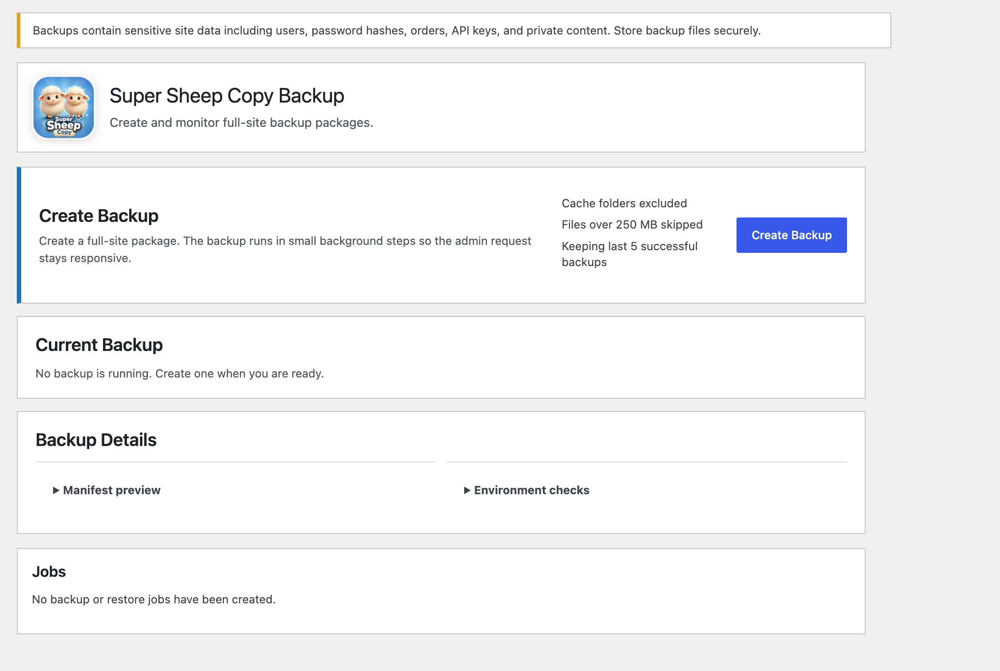

<p align="center">
  
</p>

# Super Sheep Copy

Super Sheep Copy is a WordPress plugin for creating full-site backup packages and preparing controlled restores through a standalone installer. It is built for practical migration and recovery workflows: package the current site, validate a backup on the destination site, prepare restore tooling, then run restore steps only after explicit confirmation.

<p align="center">
  
</p>

## Current Features

### Full-Site Backups

- Creates full-site backup jobs from the WordPress admin.
- Runs backups through incremental AJAX/background steps so admin requests stay responsive.
- Exports prefixed WordPress database tables into chunked SQL files.
- Uses adaptive database chunk sizes and file scan batch sizes during long backups.
- Scans site files and excludes plugin backup storage, VCS folders, `node_modules`, OS metadata files, and optionally `wp-content/cache`.
- Optionally skips files above the configured large-file limit.
- Packages database exports, site files, manifests, metadata, and checksums into the best available package format.
- Supports ZIP packages, TAR/GZ packages, and directory packages depending on server capabilities.
- Tracks job state, progress messages, performance summaries, archive size, and validation status.
- Supports retrying or continuing failed/incomplete backup jobs from the Jobs table.
- Lets administrators download completed backup archives.
- Allows backup/restore job deletion from the admin.
- Applies retention cleanup for completed backups.
- Stops running backup jobs that appear to belong to a different site or upload directory.

### Backup Settings

- Exclude or include cache folders in backups.
- Skip or include very large files using a configurable 10-2048 MB size limit.
- Configure retention for 1-20 successful backups.
- Auto-clean failed backup files after 24 hours.
- Manually clean failed backup files.
- Enable debug logging.
- Download a diagnostic report with plugin and environment details.
- View backup storage location, storage usage, and latest backup summary.
- Default settings exclude cache folders, skip files over 250 MB, retain 5 successful backups, auto-clean failed jobs, and keep debug logging disabled.

### Restore Preparation

- Validates Super Sheep Copy backup packages before restore tooling is prepared.
- Accepts `.zip`, `.tar`, and `.tar.gz` packages uploaded through WordPress for smaller backups.
- Supports large packages placed in the restore folder by FTP/SFTP.
- Supports staged directory packages when a directory contains a valid `manifest.json`.
- Lists staged restore packages from the restore folder.
- Allows staged restore packages to be selected or deleted.
- Displays validated backup details, including source URLs, active theme/plugins, table prefix, archive entry count, and database entry count.
- Prunes restore jobs when their staged package no longer exists.
- Prepares a token-protected standalone installer for the selected restore job.

### Standalone Installer

The restore process is intentionally separated from the normal WordPress admin flow. After a backup is validated, Super Sheep Copy prepares a standalone installer that handles the destructive restore workflow.

The installer includes support for:

- Token-protected launch URLs.
- Environment and destination preflight checks.
- Restore confirmation before destination changes are made.
- Rollback file collection and rollback database dumps.
- Database import preparation and chunked database import.
- Staged table swap execution.
- URL replacement planning and execution.
- Serialized value-safe URL replacement helpers.
- File restore management.
- Package path guards for archive extraction safety.

### Admin Experience

- Adds **Super Sheep Copy** admin navigation with **Backup**, **Restore**, and **Settings** pages.
- Shows environment checks and manifest previews before backup creation.
- Shows current backup progress, running indicators, job history, archive sizes, validation labels, and performance summaries.
- Uses the custom backup management capability (`manage_super_sheep_copy_backups`) with nonce checks for mutating admin actions.

## Requirements

- WordPress 6.0 or newer.
- PHP 7.4 or newer.
- At least one package writer available on the server: ZIP, TAR/GZ, or directory package fallback.
- Write access to the WordPress uploads directory.
- Administrator access with the plugin backup-management capability.

Backups are stored under the WordPress uploads directory in:

```text
wp-content/uploads/super-sheep-copy
```

Large restore packages can be placed in:

```text
wp-content/uploads/super-sheep-copy/restore
```

## Installation

1. Build or copy the `super-sheep-copy` plugin directory into `wp-content/plugins/`.
2. Activate **Super Sheep Copy** in the WordPress admin.
3. Open **Super Sheep Copy > Backup** to create and monitor backups.
4. Open **Super Sheep Copy > Restore** to validate a package and prepare the standalone installer.
5. Open **Super Sheep Copy > Settings** to review backup defaults, storage, cleanup, and diagnostics.

## Development

Install PHP dependencies:

```bash
cd super-sheep-copy
composer install
```

Run the test suite:

```bash
composer test
```

Run PHP syntax checks:

```bash
composer lint
```

Build a distributable plugin package:

```bash
composer build
```

## Repository Layout

```text
super-sheep-copy/
  assets/                 Admin CSS, JavaScript, and logo assets
  installer/              Standalone restore installer and restore engine
  shared/                 Shared archive, serialization, and URL replacement utilities
  src/                    WordPress plugin source code
  templates/              Admin page templates
  tests/                  PHPUnit tests
  super-sheep-copy.php    Plugin bootstrap file
```

## Security Notes

Backup packages contain sensitive site data, including users, password hashes, private content, order data, API keys, and configuration values. Store generated package files securely, restrict access to backup storage, and remove old packages when they are no longer needed.

Restore operations can replace files and database content on the destination site. The plugin validates archives and prepares restore tooling from the WordPress admin, but destination changes are performed through the standalone installer after confirmation.

## Status

Super Sheep Copy is version `0.1.0`. The repository currently contains the backup workflow, restore preparation workflow, standalone installer engine, settings screens, diagnostics, package reader/writer layers, URL replacement utilities, rollback helpers, and PHPUnit coverage for the core backup and restore components.
